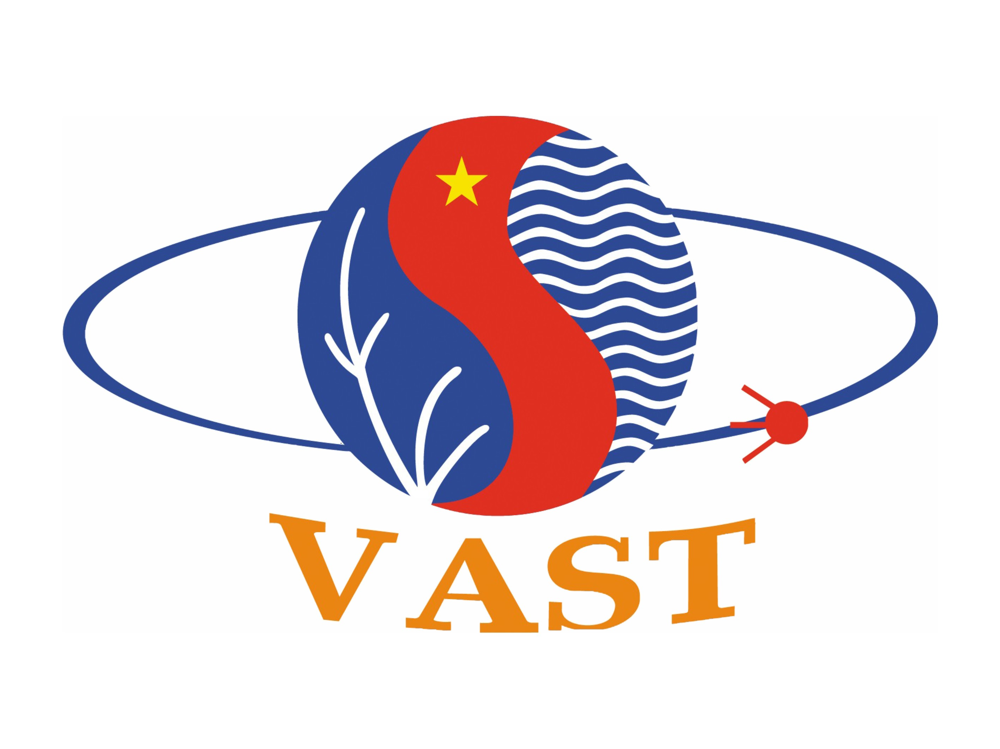
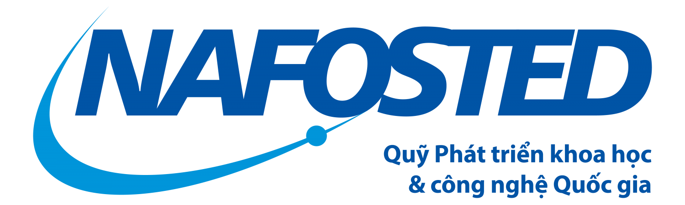

"The bigger the darkness, the easier it is to spot your little light." - Brother Andrew

### [<b>Home</b>](index.md)[<b>Members</b>](members.md)[<b>Research</b>](research.md)[<b>Publications</b>](publications.md)[<b>Courses</b>](courses.md)[<b>Softwares</b>](softwares.md)[<b>Funding</b>](fundings.md)

#### [HCMC Insitute of Physics (HCMIP)](http://hcmip.ac.vn/intro-en.html)
We are constantly supported by our home insitute!

#### [Vietnam Academy of Science and Technology (VAST)](https://vast.gov.vn/)
We will be funded by VAST via a Program for Young Researchers: 2022 - 2023.

#### [National Foundation for Science and Technology Development (NAFOSTED)](https://nafosted.gov.vn/)
Most of our research works at HCMIP have been funded by NAFOSTED: 2012 - 2014 , 2016 - 2018.

