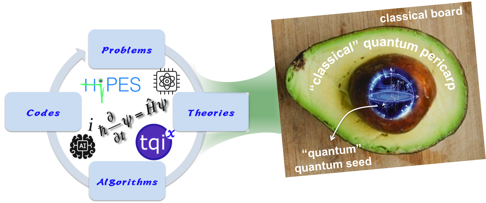

"When you change the way you look at things, the things you look at change" – Max Planck

##   [<ins>Home</ins>](index.md)[Members](members.md)[Research](research.md)[Publications](publications.md)[Courses](courses.md)[Softwares](softwares.md) 

_We are a Theoretical and Computational Lab at [Ho Chi Minh City Insitute of Physics](http://hcmip.ac.vn/index-en.html) (HCMIP), [Vietnam Academy of Science and Technology](https://vast.gov.vn/) (VAST). We conduct a variety of research topics in quantum physics and chemistry. Please see our [research page](research.md) for more details!_

### **News**
Our manuscript on the unrestricted version of OBMP2 is now on arXiv: [arXiv:2107.11260](https://arxiv.org/abs/2107.11260)

### **Funding**
HCMC Insitute of Physics (HCMIP) [2020, 2021]

Vietnam Academy of Science and Technology (VAST) [2022-2023]

National Foundation for Science and Technology Development (NAFOSTED) [2016-2018]
