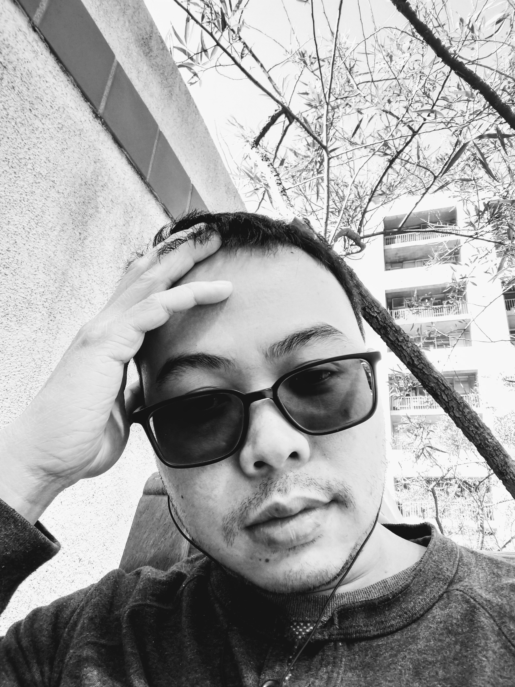

**_Our lab is employing Quantum Theory to tackle problems in physics and chemistry!_**
  
### [Home](index.md)[**Members**](members.md)[Research](research.md)[Publications](Publications)[Courses](courses.md)[Softwares](softwares.md)

### **Principal Investigator**
Tran Nguyen Lan, Ph.D. [[CV](LanTran_CV_0421.pdf)]

### **HCMIP Researchers**
Le Bin Ho, Ph.D. (JSPS postdoc at Tohoku University) [[CV](DrLeBinHo-CV.pdf)]

Nguyen Bich Duyen, M.Sc. (Ph.D. student at Central Michigan University) [[CV](NguyenBichDuyen-EN.pdf)]

Nguyen Thanh Hoang, M.Sc. (Ph.D. student at Graduate Univ. of Science and Technology) [[CV](NguyenThanhHoang-CV.pdf)]

### **Students**
Le Van Tan, M.Sc., Ph.D. student at VNUHCM-University of Science

Le Hoang Hai, M.Sc., pre-grad student at HCMIP

Le Trong Nhan, undergrad student at VNUHCM-University of Science

  
### **Collaborators**
  Prof. Takeshi Yanai, Nagoya University

  Prof. Eric Neuscamman, UC Berkeley

  Dr. Hugh Burton, University of Cambridge  
