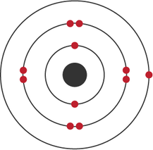

"Alone we can do so little; together we can do so much." – Helen Keller

## [Home](index.md)[<ins>Members</ins>](members.md)[Research](research.md)[Publications](publications.md)[Courses](courses.md)[Softwares](softwares.md)

### **Principal Investigator**
####  **Tran Nguyen Lan**  

Ph.D., The Graduate University for Advanced Studies, Japan 
Postdoc, University of California, Berkeley, United States 
Postdoc, University of Michigan, Ann Arbor, United States

Emails: <lantrann@gmail.com>, <tnlan@vast.hcmip.vn>

[[CV](LanTran_CV_0421.pdf)] [[Goolge Scholar](https://scholar.google.com/citations?user=fatZlQ0AAAAJ&hl=vi)]

### **HCMIP Researchers**
  
####  **Le Bin Ho** (on leave)  

 Ph.D., Osaka University, Japan  
 Postdoc, Kindai University, Japan  
JSPS postdoc, Tohoku University, Japan 

Emails: bin262@gmail.com, binho@riec.tohoku.ac.jp

[[CV](DrLeBinHo-CV.pdf)] [[Goolge Scholar](https://scholar.google.com/citations?user=jyPh9UcAAAAJ&hl=vi)]

####  **Nguyen Bich Duyen** (on leave)  

  
Ph.D. student, Central Michigan University, United States

Email: <hoamai6hh@gmail.com> 

[[CV](NguyenBichDuyen-EN.pdf)] [[Google Scholar](https://scholar.google.com/citations?user=f-3TeB8AAAAJ&hl=vi)]

####  **Nguyen Thanh Hoang**  

  
Ph.D. student, Graduate University of Science and Technology, Vietnam

Email: nthoang@hcmip.vast.vn

[[CV](NguyenThanhHoang-CV.pdf)]

### **Students**

####  **Le Van Tan** 

  
Ph.D. student, VNUHCM-University of Science, Vietnam

####  **Le Hoang Hai**  

Pre-Ph.D. student, HCMIP-VAST, Vietnam

####  **Le Trong Nhan**  

  
Undergrad student, VNUHCM-University of Science, Vietnam
  
### **Collaborators**
  [Prof. Takeshi Yanai, Nagoya University](https://www.iaqms.org/members/yanai.php)

  [Prof. Eric Neuscamman, UC Berkeley](https://neuscammanlab.com/)

  [Dr. Hugh Burton, New College, Oxford](https://www.hughburton.com/)
