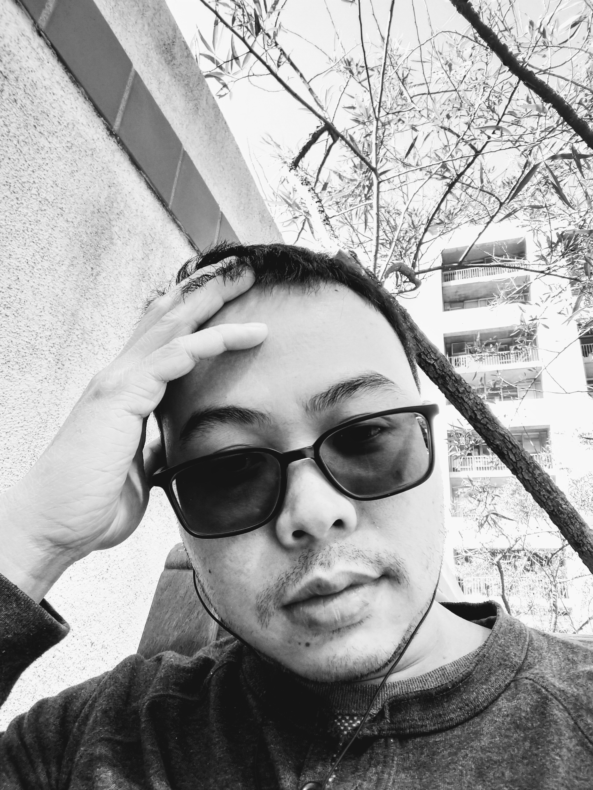
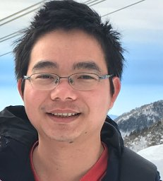
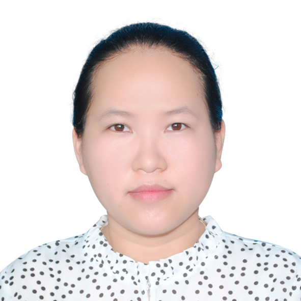
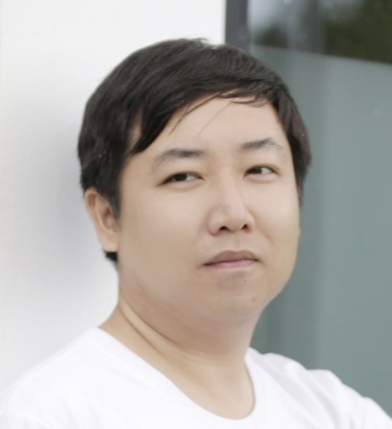
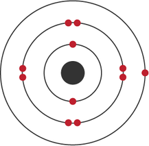
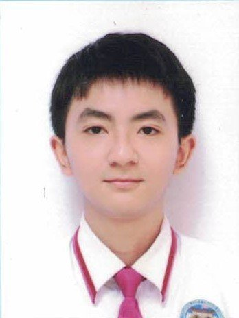

"Alone we can do so little; together we can do so much." – Helen Keller

## [Home](index.md)[<ins>Members</ins>](members.md)[Research](research.md)[Publications](publications.md)[Courses](courses.md)[Softwares](softwares.md)

### **Principal Investigator**
####  **Tran Nguyen Lan**  

2011 - 2014: Ph.D., The Graduate University for Advanced Studies, Japan 
2015 - 2018: Postdoc, The University of Michigan, Ann Arbor, United States 
2018 - 2021: Postdoc, The University of California, Berkeley, United States 
2021 - present: Researcher and Head of Department, HCMC Institute of Physics, Vietnam

Emails: <lantrann@gmail.com>, <tnlan@vast.hcmip.vn>

[[CV](LanTran_CV_0421.pdf)] [[Goolge Scholar](https://scholar.google.com/citations?user=fatZlQ0AAAAJ&hl=vi)]

### **HCMIP Researchers**
  
####  **Le Bin Ho** (on leave)  

 2015 - 2018: Ph.D., Osaka University, Japan  
 2018 - 2020: Postdoc, Kindai University, Japan  
 2020 - 2022: JSPS postdoc, Tohoku University, Japan 

<ins>Research topics</ins>: quantum computing and information, condesed-matter physics

Emails: <bin262@gmail.com>, <binho@riec.tohoku.ac.jp>

[[CV](DrLeBinHo-CV.pdf)] [[Goolge Scholar](https://scholar.google.com/citations?user=jyPh9UcAAAAJ&hl=vi)]

####  **Nguyen Bich Duyen** (on leave)  

 2018 - 2019: Ph.D. student, New Jersey Institute of Technology, United States  
2019 - present: Ph.D. student, Central Michigan University, United States 

<ins>Research topics</ins>: electronic structure, machine learning, computational chemistry

Email: <hoamai6hh@gmail.com> 

[[CV](NguyenBichDuyen-EN.pdf)] [[Google Scholar](https://scholar.google.com/citations?user=f-3TeB8AAAAJ&hl=vi)]

####  **Nguyen Thanh Hoang**  

  
2016 - present: Ph.D. student, Graduate University of Science and Technology, Vietnam

<ins>Research topics</ins>: electronic structure, nanomagnetism, condensed-matter physics

Email: <nthoang@hcmip.vast.vn>

[[CV](NguyenThanhHoang-CV.pdf)]

### **Students**

####  **Le Hoang Hai**  

Present: Pre-Ph.D. student, HCMIP-VAST, Vietnam

<ins>Research topics</ins>: electronic structure, condensed-matter physics

####  **Le Trong Nhan**  

  
2017 - present: Undergrad student, VNUHCM-University of Science, Vietnam

<ins>Research topics</ins>: electronic structure, condensed-matter physics, quantum computing
  
### **Collaborators**
  [Prof. Takeshi Yanai, Nagoya University](https://www.iaqms.org/members/yanai.php)

  [Prof. Eric Neuscamman, UC Berkeley](https://neuscammanlab.com/)

  [Dr. Hugh Burton, New College, Oxford](https://www.hughburton.com/)
