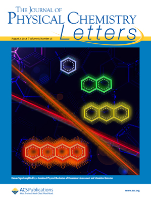
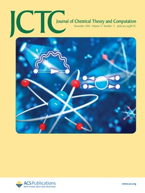
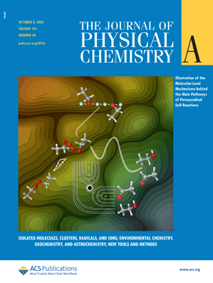
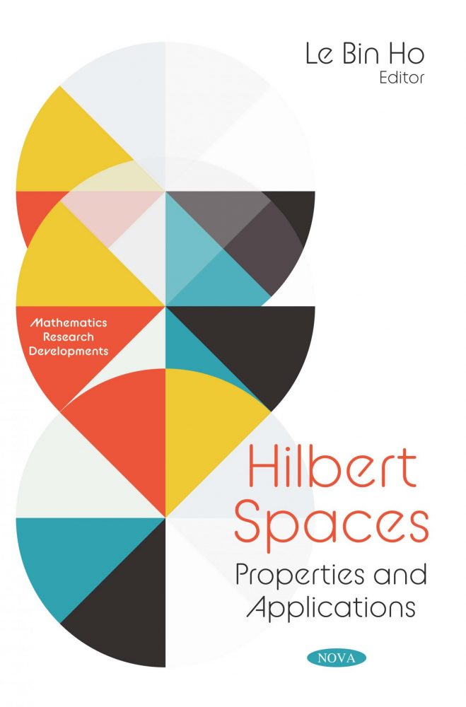

"Either write something worth reading or do something worth writing." - Benjamin Franklin

## [Home](index.md)[Members](members.md)[Research](research.md)[<ins>Publications</ins>](publications.md)[Courses](courses.md)[Softwares](softwares.md)

_Visit Google Scholar profile of [each member](members.md) for more details._

   

### **Preprints**
Lan Nguyen Tran, "Improving perturbation theory for open-shell molecules via self-consistency", [arXiv preprint arXiv:2107.11260](https://arxiv.org/abs/2107.11260), 2021

Chuong Quoc Nguyen, <ins>Le Bin Ho</ins>, <ins>Lan Nguyen Tran</ins>, Hung Quoc Nguyen, "Qsun: an open-source platform towards practical quantum machine learning applications", [arXiv preprint arXiv:2107.10541](https://arxiv.org/abs/2107.10541), 2021

### **Selected peer-reviewed papers**

#### **2021**
Kieu Quang Tuan, Hung Q Nguyen, and <ins>Le Bin Ho</ins>, "Direct state measurements under state-preparation-and-measurement errors", _Quantum Information Processing_ **20**, 197, 2021

<ins> Le Bin Ho </ins>, Kieu Quang Tuan, and Hung Q Nguyen, "tqix: A toolbox for Quantum in X: Quantum measurement, quantum tomography, quantum metrology, and others", _Computer Physics Communications_ **263** 107902, 2021

#### **Before 2021**
<ins>Lan Nguyen Tran</ins>, E. Neuscamman, "Improving excited state potential energy surfaces via optimal orbital shapes", _The Journal of Physical Chemistry A_ **124** 8273, 2020 

Le Bin Ho, "Systematic errors in direct state measurements with quantum controlled measurements" _Journal of Physics B: Atomic, Molecular and Optical Physics_ **53** 115501, 2020

<ins>Lan Nguyen Tran</ins>, J. A. R. Shea, E. Neuscamman, "Tracking excited states in wave function optimization using density matrices and varia- tional principles",
_Journal of Chemical Theory and Computation_ **15** 4790, 2019

Le Bin Ho and Lan Nguyen Tran, "Tunable cloaking of Mexican-hat confined states in bilayer silicene", _Communications in Physics_ **29** 215, 2019

Le Bin Ho, "Continuous-monitoring measured signals bounded by past and future conditions in enlarged quantum systems", _Quantum Information Processing_ **18** 206, 2019

Le Bin Ho, "Improving direct state measurements by using rebits in real enlarged Hilbert spaces", _Physics Letter A_ **383** 289, 2019

A. A. Rusakov, S. Iskakov, <ins>Lan Nguyen Tran</ins>, and D. Zgid, "Self-energy embedding theory (SEET) for periodic systems", _Journal of Chemical Theory and Computation_ **15** 229, 2018

Duyen Bich Nguyen and Lan Nguyen Tran, "Assessment of Electrocatalytic Performance of Metal-Free C-doped BN Nanoflakes for Oxygen Reduction and Hydrogen Evolution Reactions: A Comparative Study", _The Journal of Physical Chemistry C_ **122** 21124, 2018

<ins>Lan Nguyen Tran</ins>, S. Iskakov, and D. Zgid, "Spin-unrestricted self-energy embedding theory", _The Journal of Physical Chemistry Letters_ **9** 4444, 2018

<ins>Lan Nguyen Tran </ins> and D. Zgid, "Generalized self-energy embedding theory", _The Journal of Physical Chemistry Letters_ **8** 2200, 2017

<ins>Lan Nguyen Tran</ins>, A. Shee, J. Li, E. Gull, and D. Zgid, "Testing self-energy embedding theory in combination with GW", _Physical Review B_ **96** 155106, 2017

Le Bin Ho and Lan Nguyen Tran, "Photoenhanced spin/valley polarization and tunneling magnetoresistance in a ferromagnetic-normal-ferromagnetic silicene junction", _Journal of Physics D: Applied Physics_ **49**, 375106, 2016 

<ins>Lan Nguyen Tran</ins>, <ins>Le Bin Ho</ins>, and Tran Hoang Hai, "Electronic, magnetic, and spin-polarized transport properties of hybrid graphene/boron-nitride nanoribbons having 5-8-5 line defects at the heterojunction", _Physica Status Solidi B_ **252** 573, 2015

Lan Nguyen Tran, "Electronic transport properties of molecular junctions based on the direct binding of aromatic ring to electrodes", _Chemical Physics_ **428** 53, 2014

<ins>Le Bin Ho</ins>, <ins>Lan Nguyen Tran</ins>, and Tran Hoang Hai, "Monte Carlo simulations of core/shell nanoparticles containing interfacial defects: Role of disordered ferromagnetic spins", _Physica B_ **430** 10, 2013

### **Books and book chapters**

Le Bin Ho (editor), "Hilbert spaces: Properties and Applications", Nova Science Publisher (2020)

### **Selected talks**
under construction
