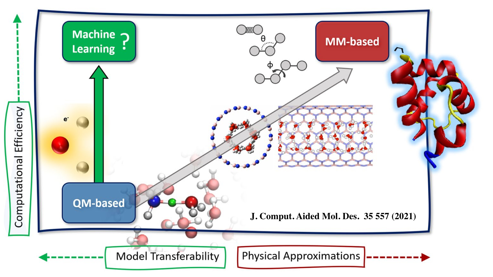

<head>
<link rel="apple-touch-icon" sizes="180x180" href="apple-touch-icon.png">
<link rel="icon" type="image/png" sizes="32x32" href="favicon-32x32.png">
<link rel="icon" type="image/png" sizes="16x16" href="favicon-16x16.png">
<link rel="manifest" href="site.webmanifest">
<link rel="mask-icon" href="safari-pinned-tab.svg" color="#5bbad5">
<meta name="msapplication-TileColor" content="#da532c">
<meta name="theme-color" content="#ffffff">
</head>

"When you change the way you look at things, the things you look at change" – Max Planck

##### [<b>Home</b>](index.md)[<b>Members</b>](members.md)[<b>Qu-Research</b>](research.md)[<b><ins>Qu2Macro</ins></b>](qu2macro.md)[<b>Publications</b>](publications.md)[<b>Courses</b>](courses.md)[<b>Softwares</b>](softwares.md)[<b>Funding</b>](fundings.md)[<b>Collab</b>](collab.md)

  
 

 
 under construction...
