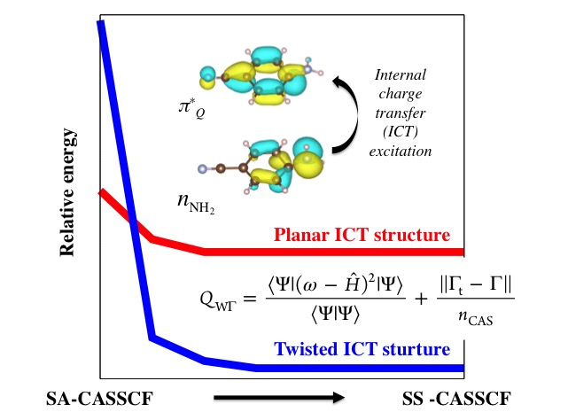
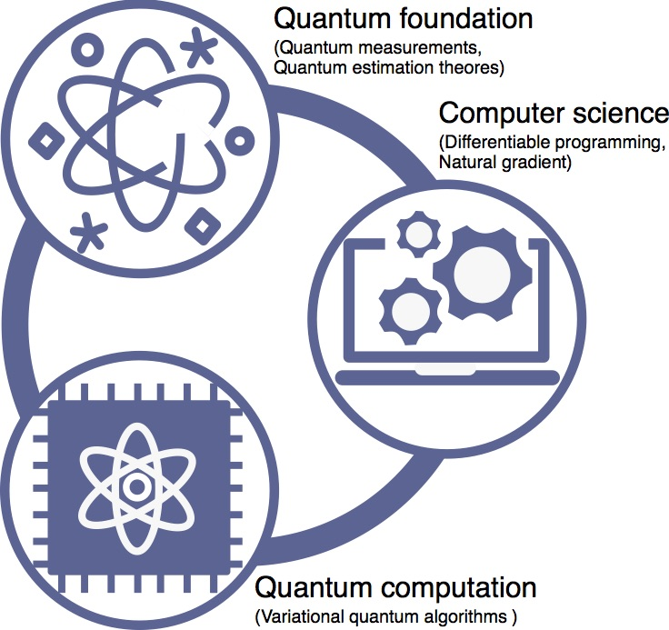
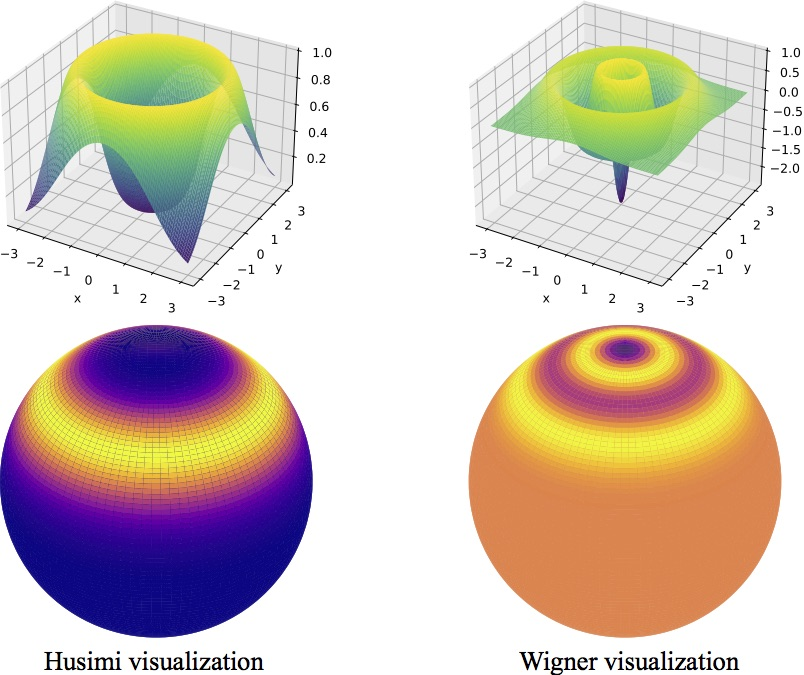
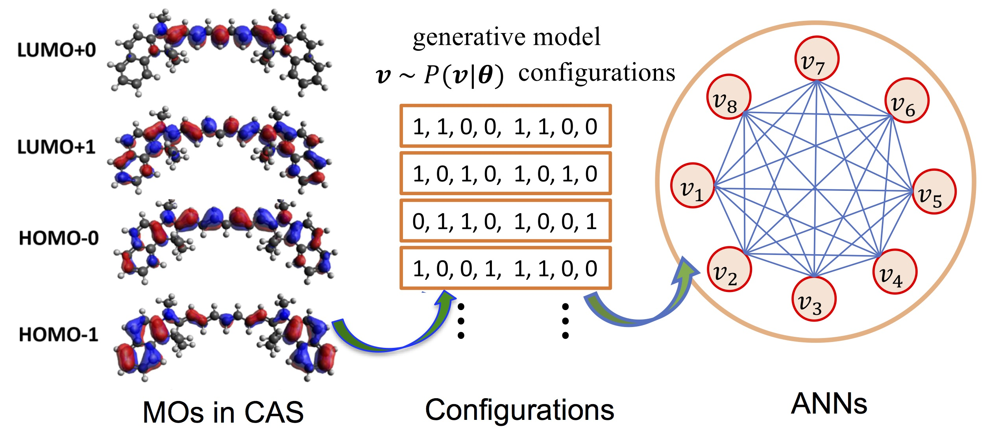
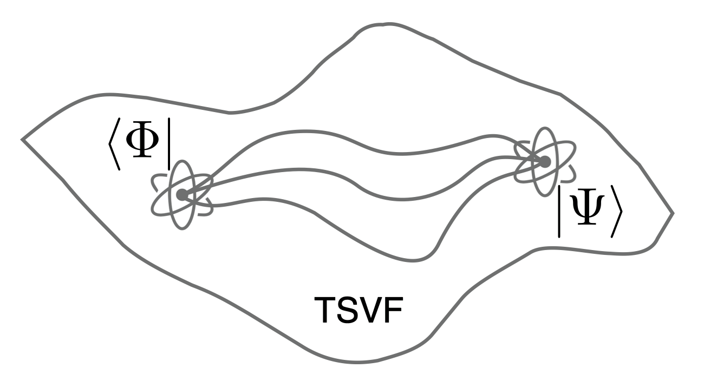
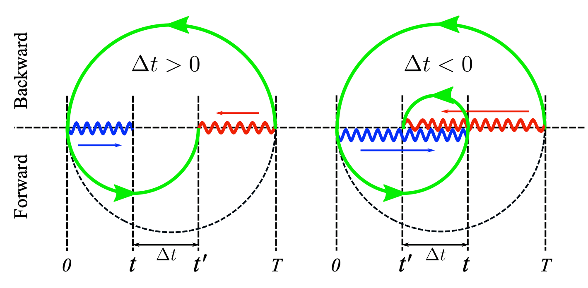
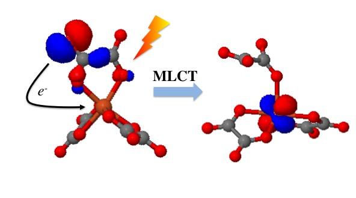
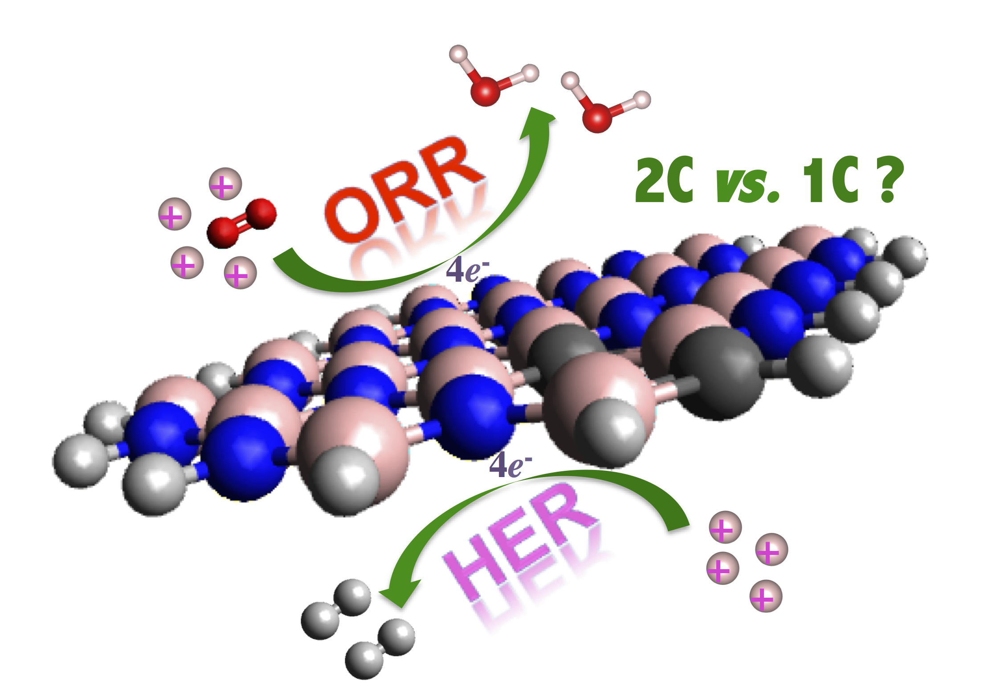
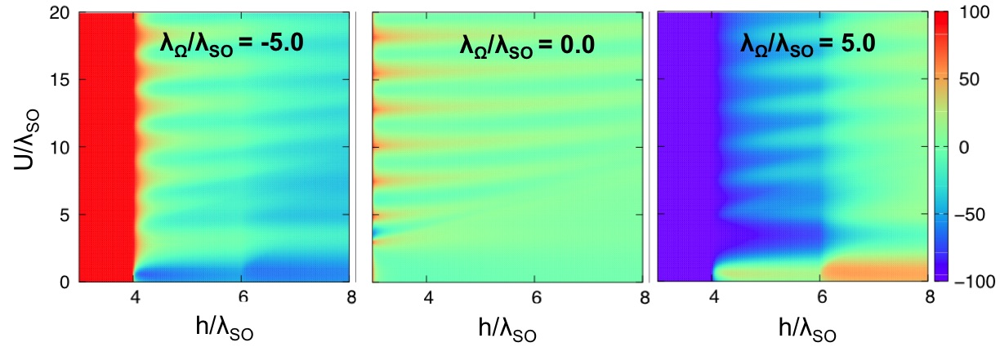

  "Everything is theoretically impossible, until it is done." – Robert A. Heinlein

## [Home](index.md)[Members](members.md)[<ins>Research</ins>](research.md)[Publications](publications.md)[Courses](courses.md)[Softwares](softwares.md)

<b>  Electronic Structure Theory   <b>

 

  
 

 <ins>active topics</ins> 

  
 - Correlated one-body methods  
  
  - Many-body Green's function methods  
  
  - Quantum embedding methods   
  
   - Excited-state methods  
   
   - Multi-configurational wave-function methods 

  
<b>   Quantum Computing and Information  </b>
  
 

  
 

  

 <ins> active topics </ins>  
  
  
  
 - Quantum metrology and measurement  
        
     - Hybrid quantum-classical frameworks  

     - Quantum computing algorithms  

     - Quantum computing softwares 

 

  
  <b>   Machine Learning in Quantum Physics </b> 
  
  

 
 

 <ins> active topics </ins> 
  

  
 - Neural network quantum states  
  
    - Machine-learning quantum tomography  
    
  - Machine-learning quantum solvers  
  
  - Electron-density learning 

  
  
 <b>   Foundation of Quantum Mechanics </b> 
  
  

 
 

 <ins> active topics </ins> 
  

  
 - Two-state vector formalism  
  
    - Weak values and modular values  
    
  - Quantum uncertainty  
  
  -  Multipartite entanglement in open systems 

  
  
<b>   Computational Quantum Chemistry  </b> 

  

  
 

 <ins> active topics </ins> 
  
  
  
 - Transition metal complexes  
    
     - Metal-free (photo)catalysis  
    
     - Non-covalent compounds  
  
      - Molecular magnetism 

<b>   Condensed-Matter Physics  </b> 
 

  
  

 <ins> active topics </ins> 

  
 
 - Topological materials  
  
  - Excitonic effects in materials  
  
  - Quantum transport

