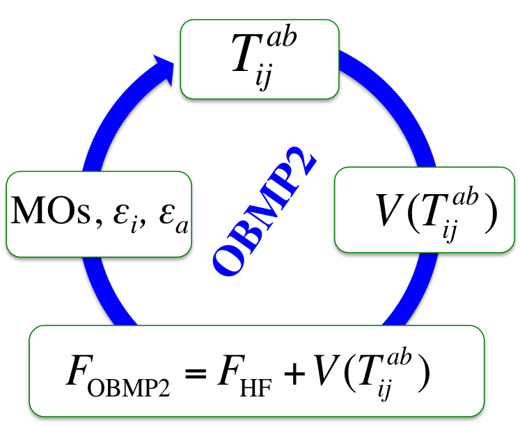

  "Everything is theoretically impossible, until it is done." – Robert A. Heinlein

### [<b>Home</b>](index.md)[<b>Members</b>](members.md)[<b><ins>Research</ins></b>](research.md)[<b>Publications</b>](publications.md)[<b>Courses</b>](courses.md)[<b>Softwares</b>](softwares.md)[<b>Funding</b>](fundings.md)

We are conducting a variety of research topics in quantum physics and chemistry. Please contact us if you are interested in joining us or a collaboration!

[>> Electronic Structure Theory](#ES) 

[>>  Quantum Computing and Information](#QCI)

[>>  Machine Learning in Quantum Physics](#MLQP)  

[>>  Foundation of Quantum Mechanics](#FQM)

[>> Computational Quantum Chemistry](#CQC) 

[>> Condensed-Matter Physics](#CMP)

<a name="ES"> <b>  Electronic Structure Theory   </b> </a>

 

  
 

 <ins>active topics</ins> 

  
 - Correlated mean-field theories  
  
  - Many-body Green's function methods  
  
  - Quantum embedding methods   
  
   - Excited-state methods  
   
   - Multi-configurational wave-function methods 

<a name="QCI"> <b>   Quantum Computing and Information  </b> </a>
  
 

  
 

  

 <ins> active topics </ins>  
  
  
  
 - Quantum metrology and measurement  
        
     - Hybrid quantum-classical frameworks  

     - Quantum computing algorithms  

     - Quantum computing softwares 

 

  
  <a name="MLQP"> <b>   Machine Learning in Quantum Physics </b> </a>
  
  

  
 

 <ins> active topics </ins> 
  

  
 - Neural network quantum states  
  
    - Machine-learning quantum tomography  
    
  - Machine-learning quantum solvers  
  
  - Electron-density learning 

  
  
 <a name="FQM">  <b>   Foundation of Quantum Mechanics </b> </a>
  
  

 
 

 <ins> active topics </ins> 
  

  
 - Two-state vector formalism  
  
    - Weak values and modular values  
    
  - Quantum uncertainty  
  
  -  Multipartite entanglement in open systems 

  
  
<a name="CQC">  <b>   Computational Quantum Chemistry  </b> </a>

  

  
 

 <ins> active topics </ins> 
  
  
  
 - Transition metal complexes  
    
     - Metal-free (photo)catalysis  
    
     - Non-covalent compounds  
  
      - Molecular magnetism 

<a name="CMP">  <b>   Condensed-Matter Physics  </b> </a>
 

  
  

 <ins> active topics </ins> 

  
 
 - Topological materials  
  
  - Excitonic effects in materials  
  
  - Quantum transport  
  
  - Strongly correlated materials

