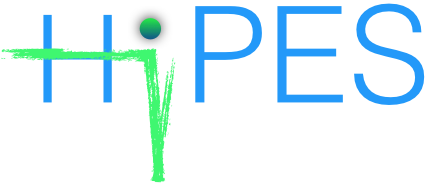

"First, solve the problem. Then, write the code." – John Johnson

## [Home](index.md)[Members](members.md)[Research](research.md)[Publications](publications.md)[Courses](courses.md)[<ins>Softwares</ins>](softwares.md)

*_These codes are developed in our lab_

> **Hi**gh-**P**erformance **E**lectronic **S**tructure program (under development)

> **T**oolbox for **Q**uantum in **X**: Quantum measurement, quantum tomography, quantum metrology, and others

[Link to code](https://vqisinfo.wixsite.com/tqix)

